# Taller Nro. 1 Configuración de una suscripción esencial en Visual Studio y Creación de una Máquina Virtual con Windows Server

## Resumen

El siguiente procedimiento le guiará en el proceso de configuración de una suscripción &quot;Dev Essentials&quot; de microsoft SQL Server, basta con tener una cuenta corporativa para realizar el proceso, una vez finalizado tendrá acceso a una cuenta gratuita de Microsoft Azure, con un saldo de 200 dólares el cual podrá consumir durante 12 meses. También tendrá acceso a una serie de aplicaciones adicionales como un repositorio de Git con Azure DevOps, y acceso a las aplicaciones de desarrollo.

## Procedimiento

1. Ingrese a my.visualstudio.com y autentíquese con su cuenta corporativa.

1. Ubique la opción &quot;Activar&quot; cuenta gratuita de Azure

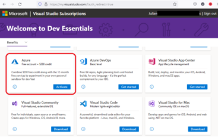

1. Una vez se activa la característica, será redirigido a la autenticación del portal de azure.

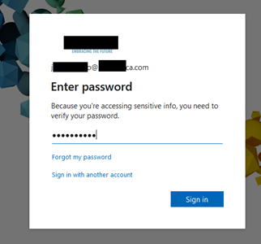

1. Diligencie el último formulario

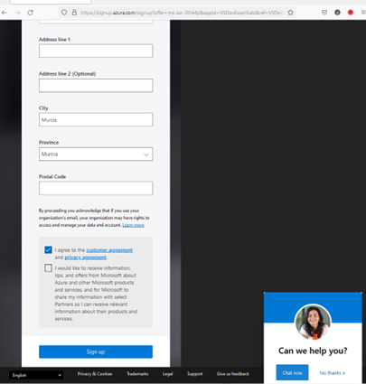

1. Una vez la información del formulario ha sido diligenciada, tomará un momento para configurar su suscripción de Dev Essential como aparece a continuación.

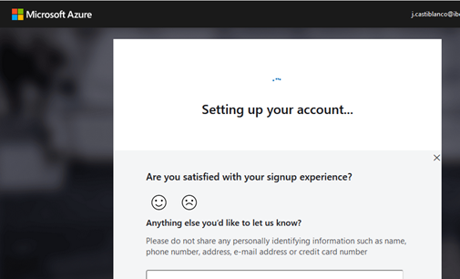

1. Una vez su cuenta a sido creada podrá ingresar al portal de azure. En este seleccione la opción &quot;Deploy a virtual machine&quot; la cual le permitirá crear una máquina nueva en modelo Infraestructura como Servicio.

1. Dado en que la nube de Microsoft Azure es totalmente posible crear servidores de tipo Linux y Windows, deberá seleccionar el tipo de sistema operativo que desea, para nuestro caso seleccionaremos una máquina virtual de tipo Windows.

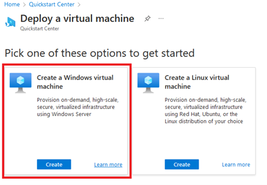

1. A continuación, en el formulario, diligencie el nombre de la máquina. En la opción de región seleccione la opción &quot;free services elegible&quot; y seleccione una región donde exista disponibilidad para la creación de su máquina.

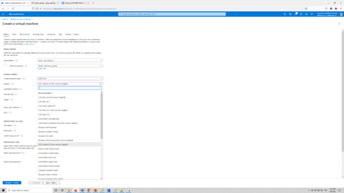

1. Seleccione las siguientes opciones
  1. En el nombre de la máquina: &quot;sqlCourse&quot;
  2. En la región: &quot;US Central US (free services eligible)&quot;.
  3. En la opción de disponibilidad seleccione &quot;No Infraestructure redundancy required&quot;.
  4. En el tipo de seguridad &quot;Standard&quot;
  5. En el tipo de imagen: &quot;Windows Server 2016 Datacenter -Gen2&quot;
  6. En el tamaño &quot;Standard\_DS1 – 1vcpu, 3.5Gb memory&quot;.
  7. En el nombre de usuario administrador: &quot;sqlAdmin&quot;
  8. Seleccione una contraseña segura.
  9. Habilite la opción &quot;Allow Selected ports&quot; (3389) para permitir acceso remoto al servidor.

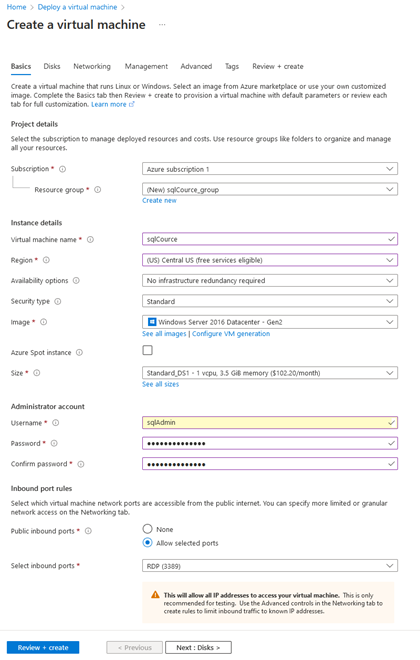

1. Ahora configuraremos el tipo de disco.
  1. En el tipo de disco del sistema operativo seleccione: &quot;Premium SSD (locally-redundant storage)&quot;
  2. Seleccione el check &quot;Delete with VM&quot;, esto permitirá eliminar el disco en el momento que decida eliminar la máquina virtual.
  3. En la opción &quot;Encryption type&quot;: Seleccione la opción por defecto.

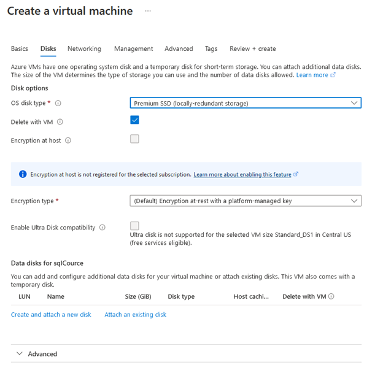

1. A continuación tiene la página de resumen de la configuración seleccionada, validamos que todo esté acorde a lo señalado y oprimimos el botón &quot;Create&quot; para crear la máquina

1. El proceso de aprovisionamiento de la máquina comienza, puede tardar entre 5 a 10 minutos.

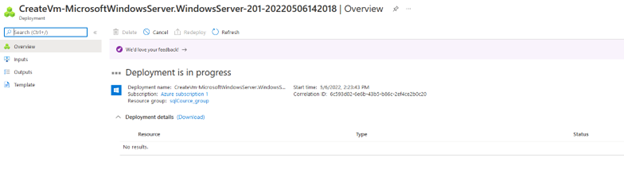

1. Una vez terminado el proceso de aprovisionamiento se activará un botón &quot;Go to resource&quot;, el cual nos permitirá ir al panel de administración de la máquina virtual.

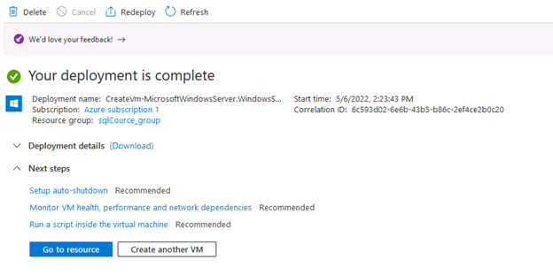

1. A continuación, en el panel de administración de la máquina, le damos clic en el botón &quot;Conectar&quot; y elegimos la opción &quot;RDP&quot; que es el modelo de conexión por defecto a las máquinas con sistema operativo Windows.

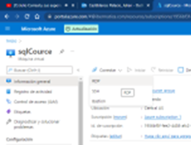

1. Validamos que la dirección pública de la máquina coincida con la de la máquina y oprimimos el botón descargar archivo RDP.

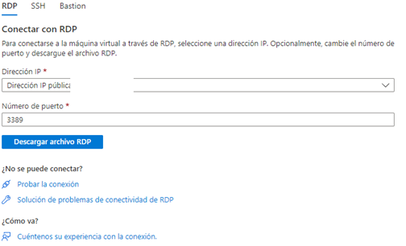

1. Una vez descargado el archivo RDP, damos clic en el archivo descargado.

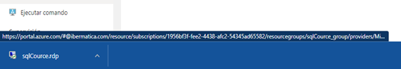

1. A continuación, al dar doble clic, introducimos el usuario y la contraseña digitados en el paso 9 de este manual, aceptamos la advertencia de acceso a la máquina y en este momento ya tenemos un servidor aprovisionado con Windows Server 2016 accesible desde cualquier lugar del mundo.

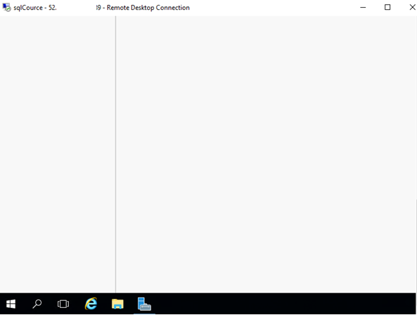

1. Cierre la maquina virtual y vuelva a la página de administración de la máquina. Oprima el botón &quot; **DETENER**&quot; para para el acceso a la máquina virtual, si no lo hace, es posible que consuma el saldo de su suscripción antes de lo deseado.
