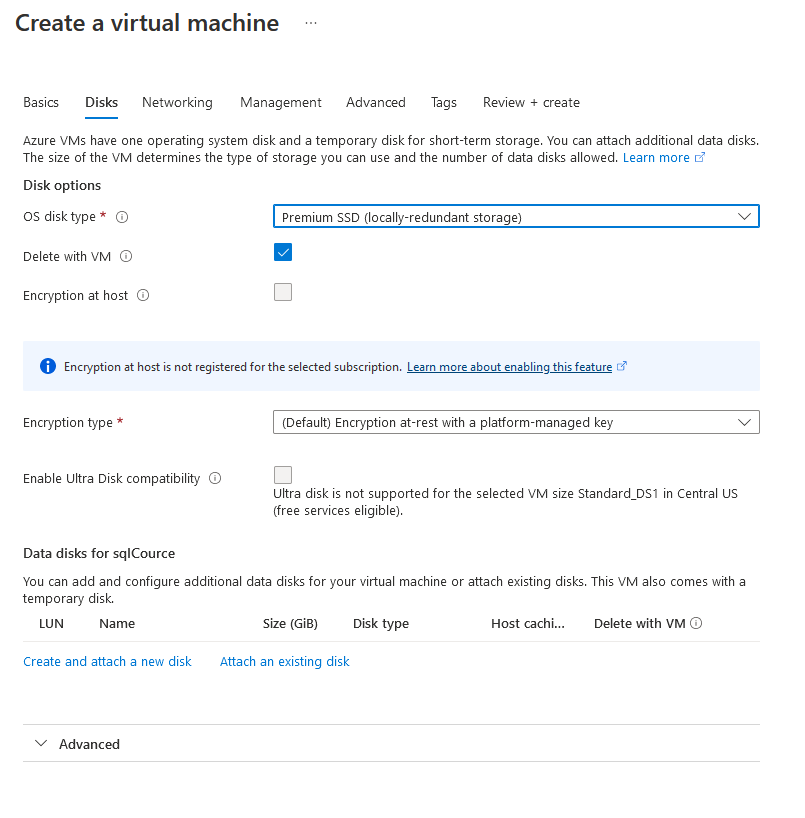

# Taller Nro. 1 Configuración de una suscripción esencial en Visual Studio y Creación de una Máquina Virtual con Windows Server

## Resumen

El siguiente procedimiento le guiará en el proceso de configuración de
una suscripción "Dev Essentials" de microsoft SQL Server, basta con
tener una cuenta corporativa para realizar el proceso, una vez
finalizado tendrá acceso a una cuenta gratuita de Microsoft Azure, con
un saldo de 200 dólares el cual podrá consumir durante 12 meses. También
tendrá acceso a una serie de aplicaciones adicionales como un
repositorio de Git con Azure DevOps, y acceso a las aplicaciones de
desarrollo.

## Procedimiento

1.  Ingrese a my.visualstudio.com y autentíquese con su cuenta
    corporativa.

{width="4.125in"
height="2.8333333333333335in"}

2.  Ubique la opción "Activar" cuenta gratuita de Azure

{width="3.8229166666666665in"
height="2.3831933508311463in"}

3.  Una vez se activa la característica, será redirigido a la
    autenticación del portal de azure.

{width="3.3541666666666665in"
height="3.12088801399825in"}

4.  Diligencie el último formulario

{width="4.224442257217848in"
height="4.428442694663167in"}

5.  Una vez la información del formulario ha sido diligenciada, tomará
    un momento para configurar su suscripción de Dev Essential como
    aparece a continuación.

{width="5.266416229221347in"
height="3.1919214785651793in"}

6.  Una vez su cuenta a sido creada podrá ingresar al portal de azure.
    En este seleccione la opción "Deploy a virtual machine" la cual le
    permitirá crear una máquina nueva en modelo Infraestructura como
    Servicio.

{width="6.079195100612424in"
height="4.325581802274716in"}

7.  Dado en que la nube de Microsoft Azure es totalmente posible crear
    servidores de tipo Linux y Windows, deberá seleccionar el tipo de
    sistema operativo que desea, para nuestro caso seleccionaremos una
    máquina virtual de tipo Windows.

{width="4.721738845144357in"
height="3.268896544181977in"}

8.  A continuación, en el formulario, diligencie el nombre de la
    máquina. En la opción de región seleccione la opción "free services
    elegible" y seleccione una región donde exista disponibilidad para
    la creación de su máquina.

{width="6.0649682852143485in"
height="3.411544181977253in"}

9.  Seleccione las siguientes opciones

    a.  En el nombre de la máquina: "sqlCourse"

    b.  En la región: "US Central US (free services eligible)".

    c.  En la opción de disponibilidad seleccione "No Infraestructure
        redundancy required".

    d.  En el tipo de seguridad "Standard"

    e.  En el tipo de imagen: "Windows Server 2016 Datacenter -Gen2"

    f.  En el tamaño "Standard_DS1 -- 1vcpu, 3.5Gb memory".

    g.  En el nombre de usuario administrador: "sqlAdmin"

    h.  Seleccione una contraseña segura.

    i.  Habilite la opción "Allow Selected ports" (3389) para permitir
        acceso remoto al servidor.

{width="4.382036307961505in"
height="6.8854494750656166in"}

10. Ahora configuraremos el tipo de disco.

    a.  En el tipo de disco del sistema operativo seleccione: "Premium
        SSD (locally-redundant storage)"

    b.  Seleccione el check "Delete with VM", esto permitirá eliminar el
        disco en el momento que decida eliminar la máquina virtual.

    c.  En la opción "Encryption type": Seleccione la opción por
        defecto.

{width="6.5in"
height="6.604861111111111in"}

11. A continuación tiene la página de resumen de la configuración
    seleccionada, validamos que todo esté acorde a lo señalado y
    oprimimos el botón "Create" para crear la máquina

{width="4.924779090113736in"
height="7.960231846019248in"}

12. El proceso de aprovisionamiento de la máquina comienza, puede tardar
    entre 5 a 10 minutos.

{width="6.5in"
height="1.8458333333333334in"}

13. Una vez terminado el proceso de aprovisionamiento se activará un
    botón "Go to resource", el cual nos permitirá ir al panel de
    administración de la máquina virtual.

{width="6.5in"
height="3.238888888888889in"}

14. A continuación, en el panel de administración de la máquina, le
    damos clic en el botón "Conectar" y elegimos la opción "RDP" que es
    el modelo de conexión por defecto a las máquinas con sistema
    operativo Windows.

{width="3.9798556430446195in"
height="3.0117825896762906in"}

15. Validamos que la dirección pública de la máquina coincida con la de
    la máquina y oprimimos el botón descargar archivo RDP.

{width="5.252174103237095in"
height="3.190021872265967in"}

16. Una vez descargado el archivo RDP, damos clic en el archivo
    descargado.

> {width="5.939070428696413in"
> height="1.0360990813648294in"}

17. A continuación, al dar doble clic, introducimos el usuario y la
    contraseña digitados en el paso 9 de este manual, aceptamos la
    advertencia de acceso a la máquina y en este momento ya tenemos un
    servidor aprovisionado con Windows Server 2016 accesible desde
    cualquier lugar del mundo.

> {width="6.178261154855643in"
> height="4.657458442694663in"}

18. Cierre la maquina virtual y vuelva a la página de administración de
    la máquina. Oprima el botón "**DETENER**" para para el acceso a la
    máquina virtual, si no lo hace, es posible que consuma el saldo de
    su suscripción antes de lo deseado.
