# TALLER No 2. INSTALACIÓN SQL SERVER

## Resumen

El siguiente ejercicio plantea el paso a paso de instalación de una
instancia de SQL Server en la máquina creada en el laboratorio
inmediatamente anterior. Dado que la máquina fue creada con los mínimos
recursos, se realizará una instalación por defecto. Es importante que
para ambientes corporativos siempre se sigan las buenas prácticas
mencionadas a lo largo del curso.

## Procedimiento

1.  Descargue el medio de sql server developer edition
    https://go.microsoft.com/fwlink/?linkid=866662

{width="2.4895833333333335in"
height="0.7708333333333334in"}

2.  Una vez descargado, haga doble clic en el ejecutable, seleccione la
    tercera opción "Download Media" para descargar el archivo iso
    completo. Dejelo en la ruta C:\\temp, de su máquina. En caso que no
    exista dicha ruta, créela y redireccione el iso para que quede en
    esta misma.

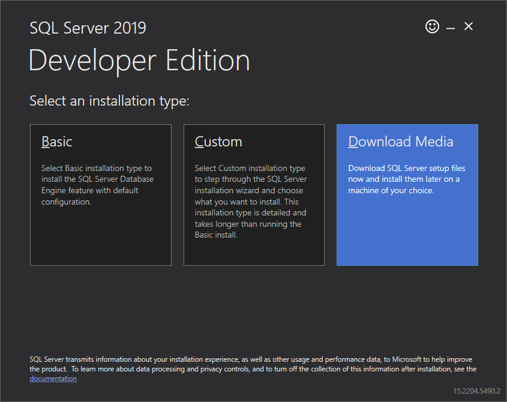{width="4.088395669291339in"
height="3.241888670166229in"}

3.  Recuerde que la Edición Developer es una edición gratuita, con
    algunas limitaciones como por ejemplo que no puede ser utilizada en
    ambientes productivos. El fabricante podrá realizar auditorias de
    software a las entidades y en caso de encontrar irregularidades en
    el uso del licenciamiento puede generar multas asociadas al
    incumplimiento del acuerdo de uso del producto.

> 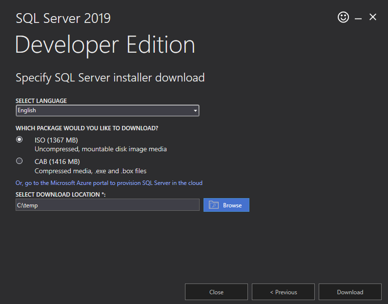{width="4.20130905511811in"
> height="3.2923720472440943in"}

4.  Una vez descargado el medio. De clic derecho sobre el archivo
    descargado y en la opción "Mount", para cargar el medio de
    instalación en el sistema operativo. Aparecerá una unidad nueva en
    su explorador de archivos. Allí seleccione el archivo "Setup.exe".

5.  Se selecciona la primera opción

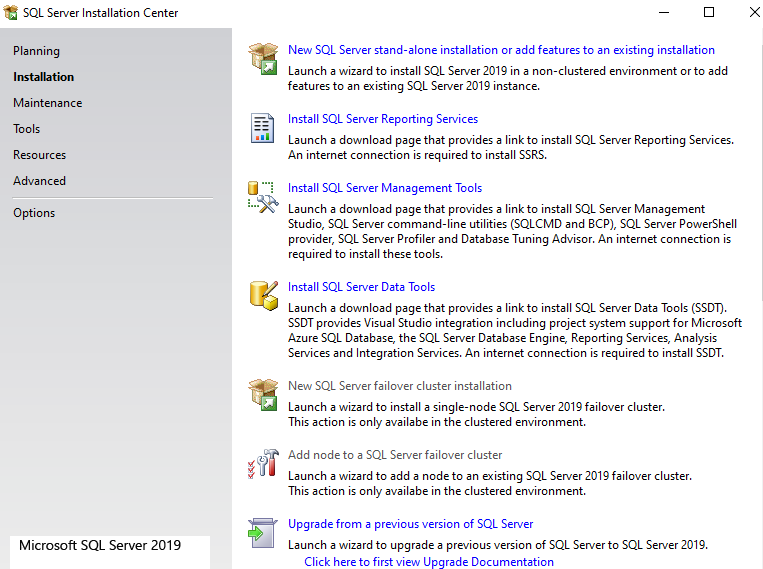{width="4.4742257217847765in"
height="3.3365485564304462in"}

6.  Una vez inicia la instalación, se realiza la validación de
    consistencia de registros, que el servidor no sea un controlador de
    dominio y que no existan versiones de prueba del producto
    previamente instaladas.

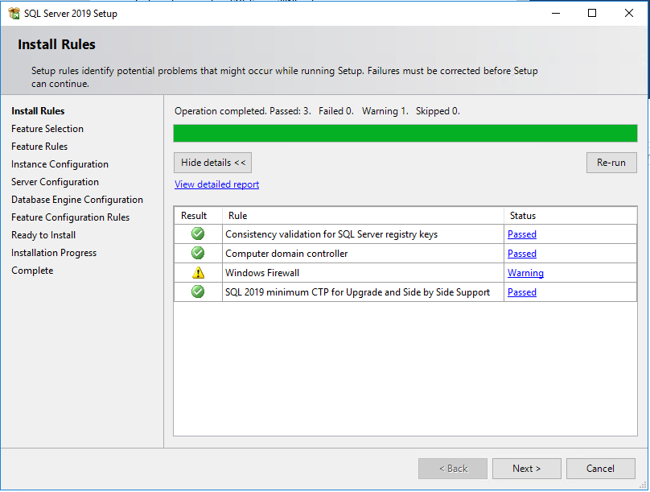{width="4.109531933508311in"
height="3.107613735783027in"}

7.  Deje la opción de licencia "Developer" por defecto, note que este
    mismo medio le permite instalar también la opción express del
    producto, que es totalmente gratuita y si se puede usar en ambientes
    productivos.

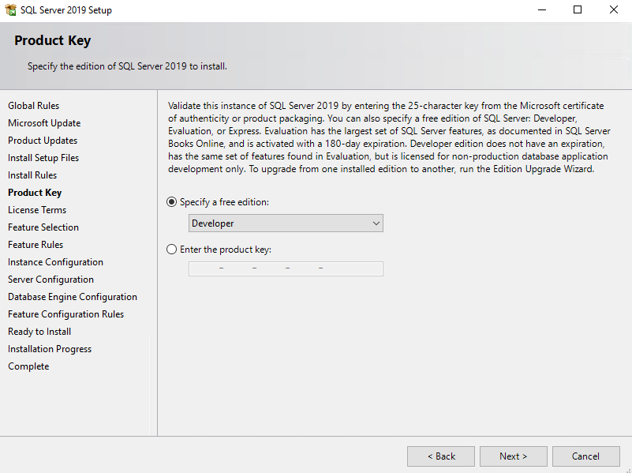{width="3.9678816710411198in"
height="2.967432195975503in"}

8.  Siguiendo las buenas practicas de instalación y configuración de
    producto, seleccione solo las características que requiere, para
    nuestro caso los siguientes servicios:

    a.  Database Engine Services

    b.  Full-Text and Semantic Extractions for Search

    c.  Client Tools Connectivity

    d.  Client Tools SDK

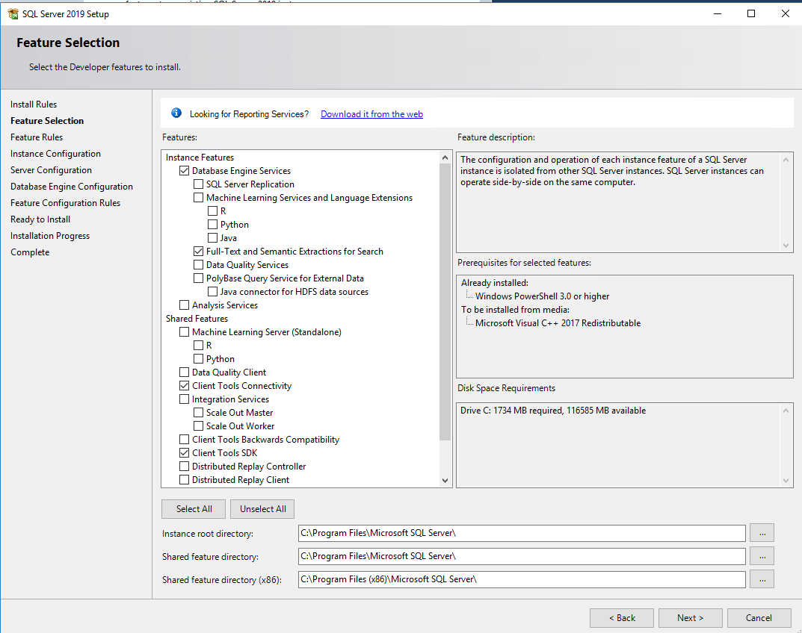{width="4.324882983377078in"
height="3.3886832895888013in"}

9.  Seleccione el nombre de la instancia, por defecto la instancia
    tendrá el nombre MSSQLSERVER

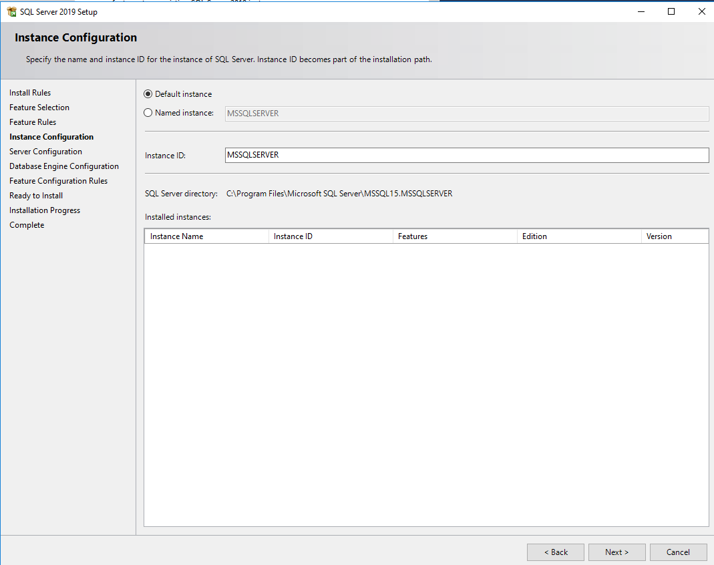{width="4.594083552055993in"
height="3.6078871391076115in"}

10. A continuación, se realiza la configuración de las cuentas de
    servicio, por defecto la buena práctica indica que se utilicen
    cuentas de servicio administradas, bien sea de dominio, si los
    servicios de SQL server requieren interactuar con recursos externos
    al servidor o con cuentas locales administradas si solo requiere
    acceso a objetos en el servidor.

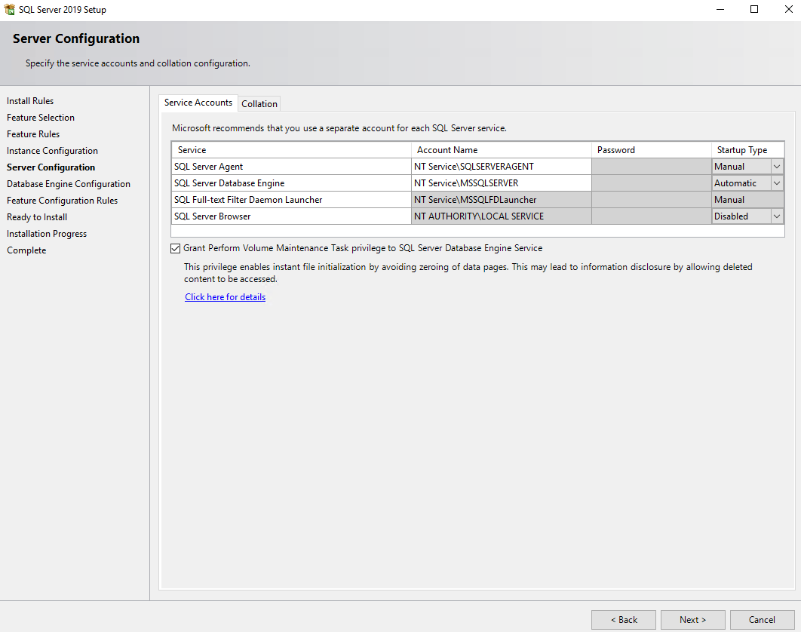{width="4.660075459317586in"
height="3.677279090113736in"}

11. A continuación, se eligen los usuarios que tendrán control total de
    la instancia o role "SysAdmin", como buena práctica agregue grupos
    de directorio activo en vez de usuarios nombrados. En lo posible,
    intente no habilitar el modo de autenticación mixto, para evitar la
    administración de contraseñas en el motor.

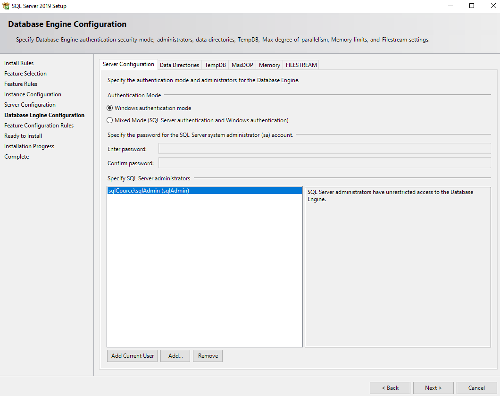{width="4.451667760279965in"
height="3.5237609361329834in"}

12. Configuración de las rutas de instalación de las bases de datos. Por
    defecto en un ambiente corporativo es preferible tener unidades
    diferentes para los archivos de datos y los archivos de log
    transaccional.

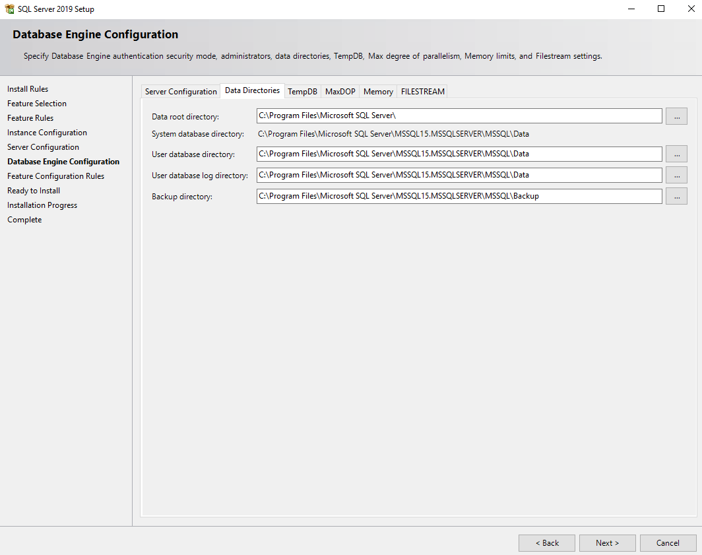{width="4.663059930008749in"
height="3.685609142607174in"}

13. En la siguiente pantalla se configura el número de archivos para la
    base de datos TempDB de la instancia, esta base de datos es una base
    temporal común para todas las bases de datos en la instancia, en
    ella el motor creará automáticamente tablas con el resultado de los
    "joins" que se realicen en las consultas, agrupaciones y/o
    ordenamientos. Dado que es una base de datos común para todas las
    bases de usuario en la instancia, puede convertirse en un cuello de
    botella. Existen algunos artículos que mencionan que la mejor
    afinidad es tener un archivo de TempDB por cada core asignado a la
    instancia. Otros por el contrario has demostrado que si el número de
    cores en la instancia es menor a 8, normalmente siempre se hará uso
    del primer archivo de datos. De tal suerte que se recomienda usar un
    archivo si su instancia tiene hasta 4 cores, configure 2 archivos si
    tiene hasta 8 cores y de allí en adelante puede validar los
    contadores de sql server para validar si existe algún problema de
    afinamiento en la escritura de datos en la base tempdb. Para
    sistemas altamente transaccionales con más de 8 procesadores
    asociados puede aumentar el número de archivos en la base de datos
    TempDB y validar si esto mejora los tiempos de respuesta de sus
    bases de datos.

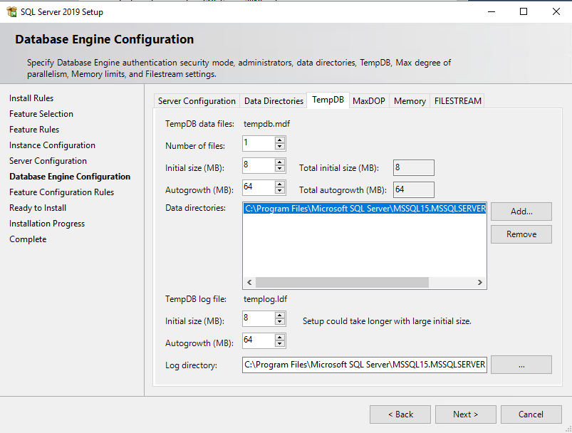{width="5.908409886264217in"
height="4.47359908136483in"}

14. El grado de paralelismo permite al administrador de base de datos
    decidir cuantos cores van a ser utilizados para resolver una misma
    consulta. Para decidir el mejor valor en MAXDOP es necesario conocer
    los tipos de carga que maneja el motor. En servidores altamente
    transaccionales pero atómicos (sistemas de inventarios, Sharepoint,
    sistemas de IoT) se recomienda configurar el parámetro en 1, a fin
    de atender el máximo número de transacciones en paralelo. Por otro
    lado, cuando las bases son más analíticas el parámetro MAXDOP
    debería tener un numero muy cercano o igual al número total de cores
    expuestos a la instancia, esto asegura que las consultas se
    resuelvan mucho más rápido.

> 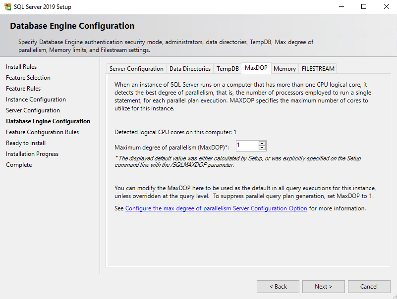{width="5.618779527559055in"
> height="4.236895231846019in"}

15. Por último, se configura la memoria asignada a la instancia. Por
    defecto SQL Server tiene el parámetro configurado para utilizar toda
    la memoria del servidor, lo cual definitivamente es una mala
    práctica porque puede bloquear el sistema operativo. Se recomienda
    asignar máximo hasta un 95% de la memoria disponible a fin de dejar
    memoria suficiente para el funcionamiento del sistema operativo. En
    las últimas versiones el asistente calcula la memoria del sistema y
    automáticamente propone al administrador un valor, si está de
    acuerdo de clic en el check de aceptar la recomendación de memoria y
    finalice el paso.

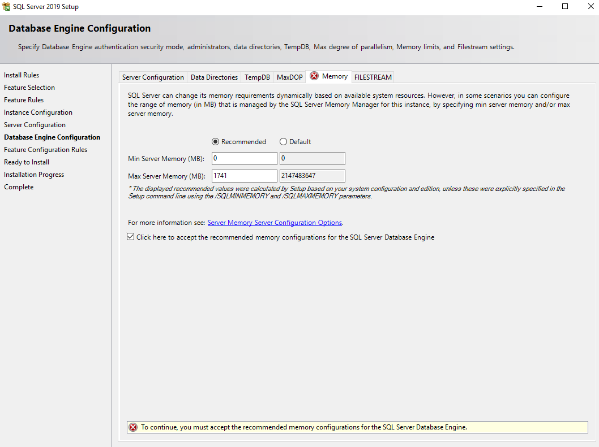{width="5.0116447944007in"
height="3.7469542869641295in"}

16. Ahora que ha terminado la configuración del producto, ha llegado al
    resumen del mismo, algo que normalmente no se nota, es la
    posibilidad de guardar la configuración de instalación de la
    instancia. Esto se puede tomar para tener una plantilla por defecto
    que podrá ser utilizada en configuraciones posteriores y/o
    instalaciones desatendidas. Copie la ruta del archivo y diríjase a
    la carpeta

> 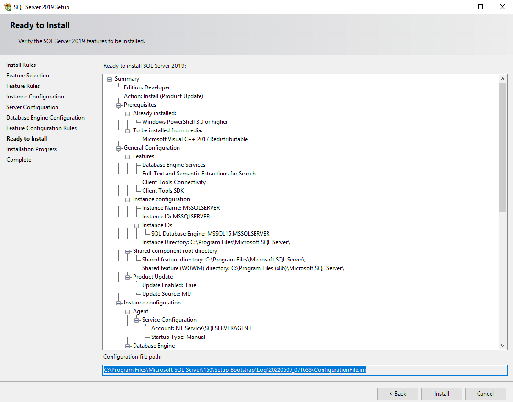{width="5.064698162729659in"
> height="3.9732983377077864in"}

17. Una vez en la carpeta temporal de instalación copie el archivo
    ConfigurationFile.config y llévelo a la carpeta de trabajo C:\\temp
    creada en pasos anteriores de este manual.

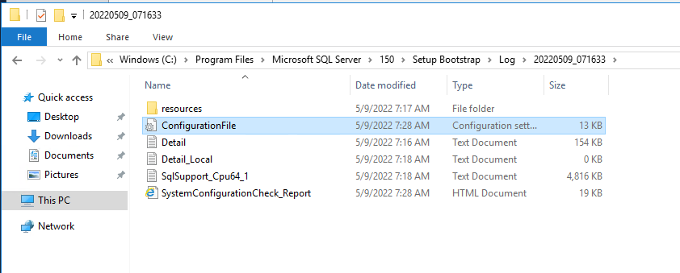{width="6.5in"
height="2.6166666666666667in"}

17.Una vez tiene el archivo en la carpeta de trabajo, cancele la
instalación actual sin guardar cambios.

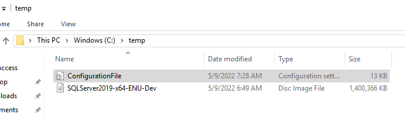{width="6.5in"
height="1.9416666666666667in"}

18. Cancele el proceso de instalación actual.

> 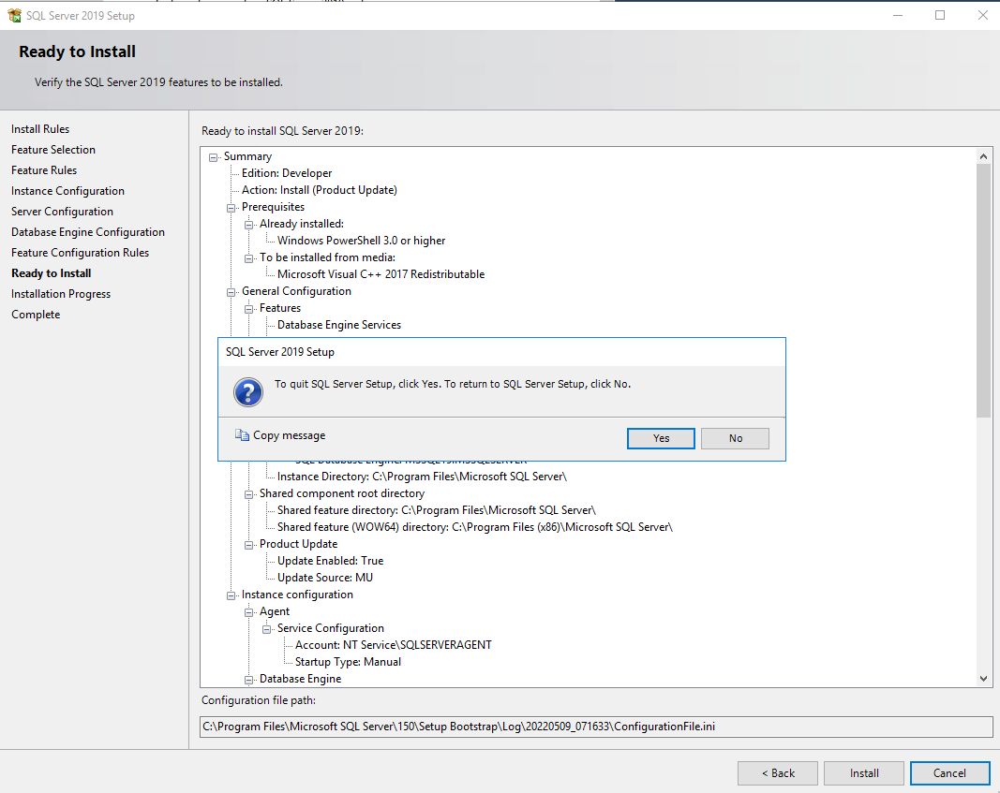{width="5.743430664916885in"
> height="4.559154636920385in"}

19. Ingrese nuevamente al instalador y seleccione la opción
    "**Advanced**" en el menú de la izquierda y a continuación la opción
    "**Install base don configuration file**".

> 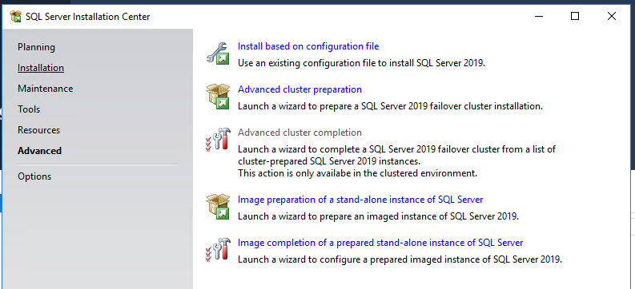{width="6.333333333333333in"
> height="2.8631944444444444in"}

20. Seleccione el archivo de configuración de la ruta C:\\temp que se
    creó en el paso 17 de este manual.

> 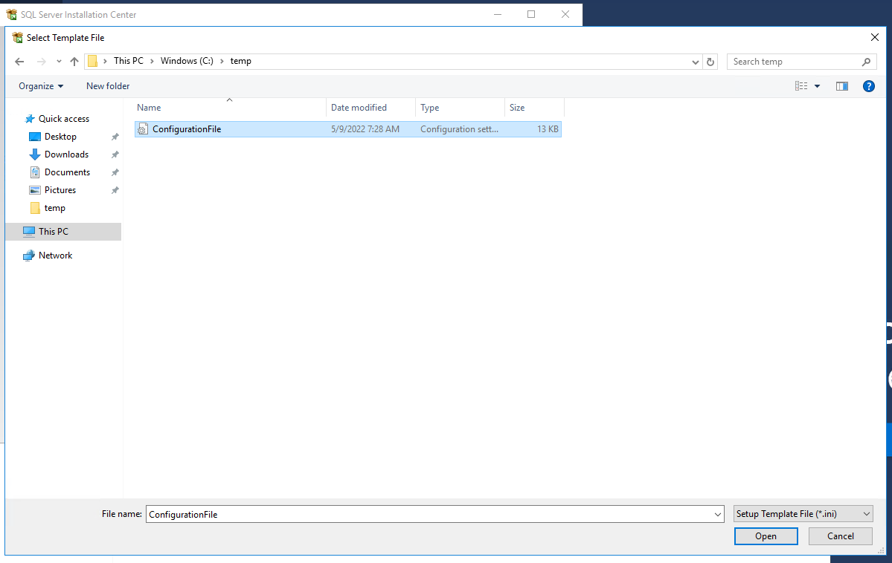{width="4.931233595800525in"
> height="3.1173195538057743in"}

21. Ejecute todo el asistente validando que los valores ya están
    diligenciados con los valores del archivo de configuración.

> 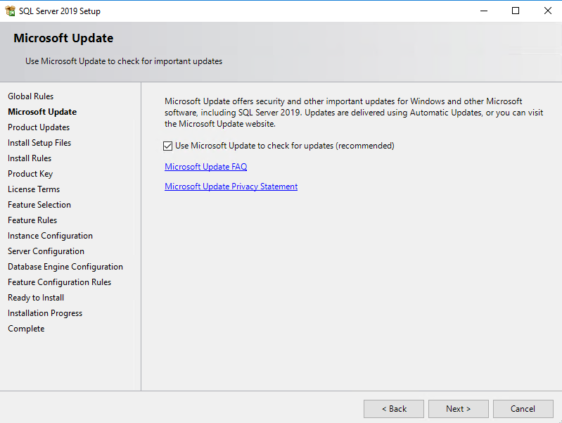{width="5.2505358705161855in"
> height="3.9496817585301836in"}

22. Después de dar clic en "Next" en todos los pasos del asistente.
    Instale el producto.

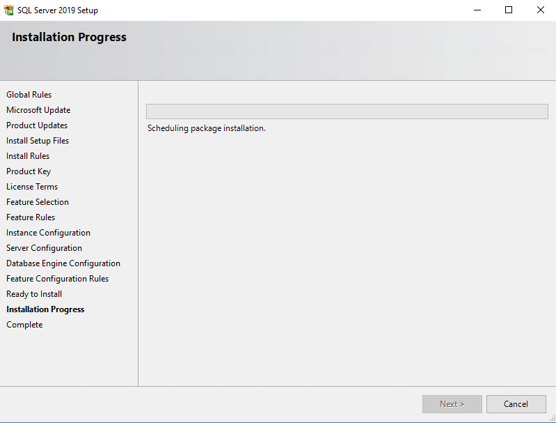{width="4.531000656167979in"
height="3.4423009623797025in"}

23. Una vez finalizada la instalación del motor. Es tiempo de instalar
    SQL Server Management Studio (SSMS), que es la herramienta que
    distribuye gratuitamente Microsoft para administrar las bases de
    datos de SQL Server. Cabe resaltar que no solo a través de (SSMS) se
    pueden gestionar bases de datos de SQL Server, existen otros
    productos gratuitos como Azure Data Studio, Visual Studio Code y/o
    Visual Studio Community desde los cuales también puede gestionar
    gran parte de sus instancias de SQL Server. Para ello descargue la
    última versión de la siguiente ruta: <https://aka.ms/ssmsfullsetup>

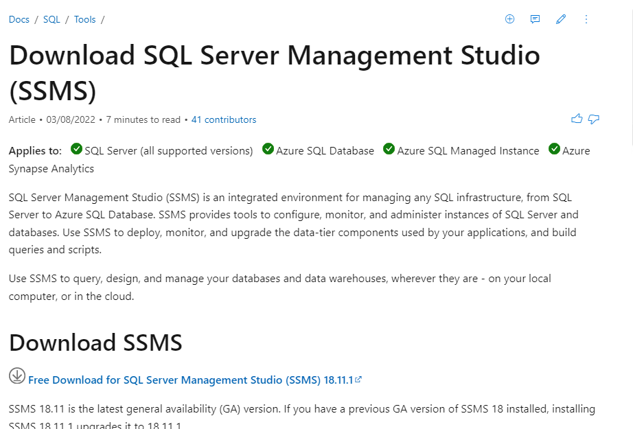{width="4.693766404199475in"
height="3.181832895888014in"}
