# TALLER DE COPIAS DE SEGUIRIDAD Y RESTAURACIÓN DE BASES DE DATOS

## Resumen

El siguiente taller le permitirá entender y aplicar los diferentes tipos
de backups disponibles en SQL Server. Para esto, utilizará la base de
pruebas disponible por el fabricante y algunos scripts adjuntos en la
práctica.

## Procedimiento

1.  Ingrese al portal de Azure y encienda la máquina virtual creada en
    el taller número 2.

2.  Descargue nuevamente la conexión RDP, esto debido a que la dirección
    pública de su máquina pudo cambiar en el tiempo.

3.  Conéctese al escritorio remoto e ingrese al navegador de su
    preferencia.

4.  Descargue una copia del backup de la base de datos
    WideWorldImporters que se encuentra en la siguiente URL.

<https://recursossqlserver.blob.core.windows.net/recursos/WideWorldImporters-Full.bak>

5.  Una vez Descargada una copa del backup de la base de datos, vamos a
    realizar el procedimiento a través de la interfaz gráfica para
    recuperar una base de datos. Para ello acceda a SQL Server
    Management Studio y sobre la carpeta de "Databases" seleccione la
    opción "Restore".

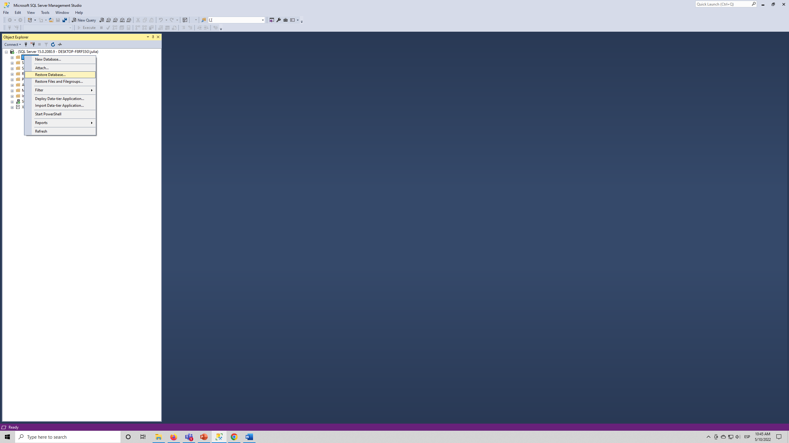{width="2.3916951006124236in"
height="2.3454068241469814in"}

6.  En la ventana de "Restore Database" que se abrió, seleccione la
    opción "Device" la cual le permitirá seleccionar la ruta donde se
    encuentra la copia de seguridad que va a restaurar en la máquina.
    Luego de clic en los tres puntos que se encuentran frente al método
    de restauración seleccionado y busque el backup descargado en el
    paso 5.

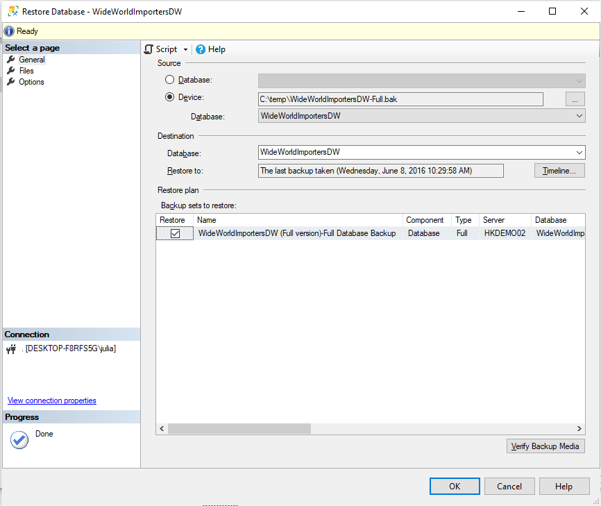{width="6.482609361329834in"
height="1.4173917322834646in"}

7.  Note que, al seleccionar el archivo, inmediatamente el backup carga
    una información básica, como por ejemplo el nombre de base de datos
    con que se restaurará, la fecha de la última generación del backup y
    en la parte de abajo de la ventana el historial de copias de
    seguridad existentes en el archivo. Recuerde que en SQL server puede
    almacenar varias copias de una base de datos en el mismo archivo
    para simplificar las tareas de restauración.

{width="4.19531605424322in"
height="3.531505905511811in"}

8.  A continuación, seleccionamos la opción Files, para configurar la
    ruta en la cual deseamos restaurar la base de datos, como se vio en
    la presentación, una base de datos de SQL server está compuesta como
    mínimo de 2 archivos (datos mdf y log). El check realocate le
    permite elegir la ruta en que dejará los archivos en este nuevo
    servidor

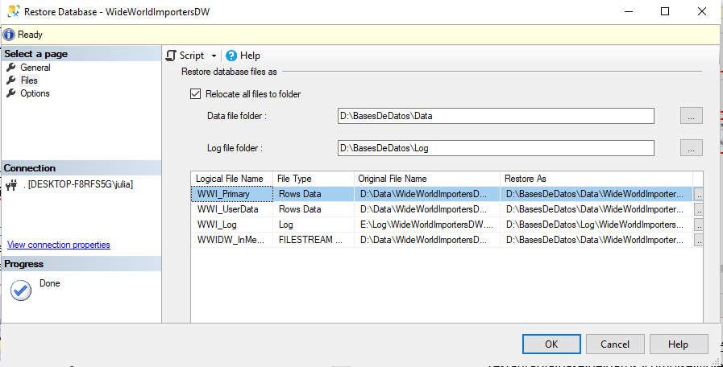{width="5.548930446194226in"
height="2.820705380577428in"}

9.  Ahora, seleccione la página "Options" y valide los estados de
    recuperación de los backups, deje la opción por defecto y seleccione
    el check de Overwrite. Y seleccione el botón OK.

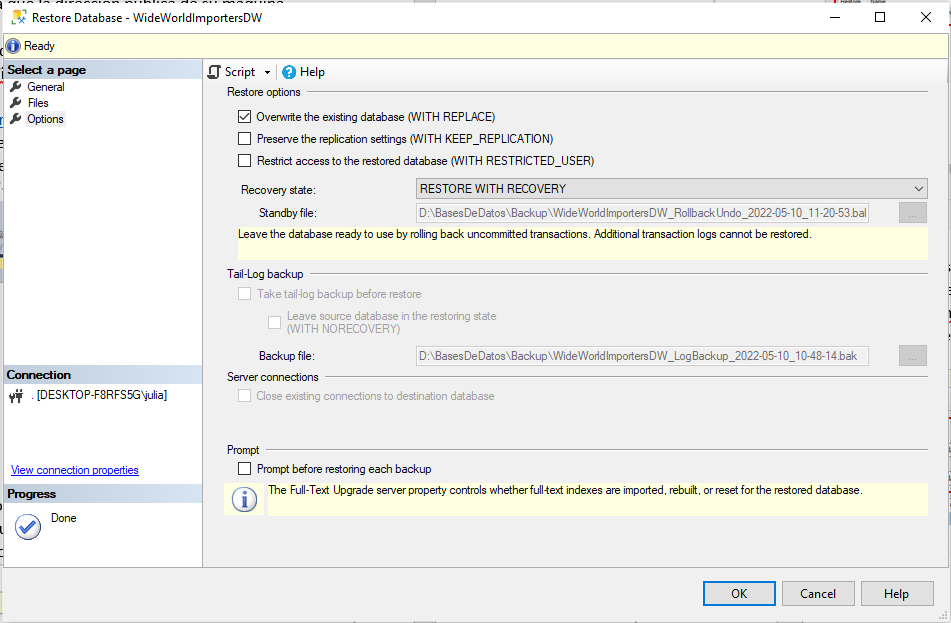{width="5.832364391951006in"
height="3.820945975503062in"}

10. Una vez finalizada la restauración, el sistema notificará la
    finalización con el siguiente mensaje, acepte el mensaje y compruebe
    en SQL Server Management Studio que la base de datos esté
    disponible.

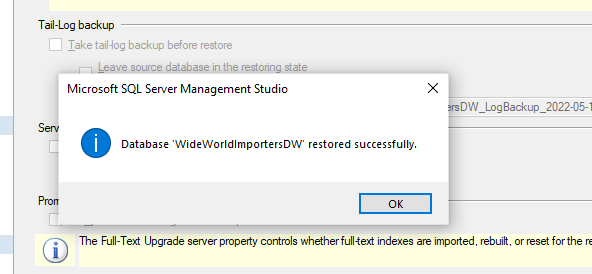{width="5.490672572178478in"
height="2.5412904636920386in"}

11. Ahora que ya tenemos la base de datos disponible vamos a cambiar el
    modelo de recuperación de la misma para dejarla en modo "Full" o
    total. Recuerde que este modo de recuperación es utilizado
    normalmente en las bases transaccionales. Para ello damos clic
    derecho sobre la base de datos, "properties" y a continuación vamos
    a la página "Options" allí podremos ver la característica del modelo
    de recuperación. Una vez que demajos el modelo de recuperación en
    "Full" oprima el botón "OK" para aceptar los cambios.

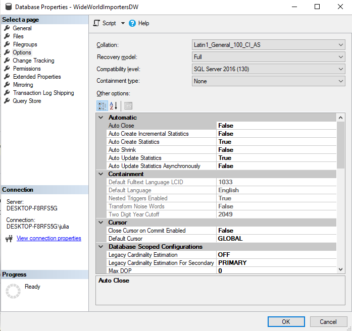{width="4.08178915135608in"
height="3.8415037182852143in"}

12. Generación de una copia total de la base de datos.

> BACKUP DATABASE WideWorldImportersDW TO
> DISK=\'C:\\temp\\WideWorldImportersDW_withOutCompression.BAK\'

GO

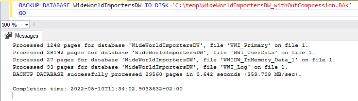{width="6.180439632545932in"
height="1.8437051618547682in"}

13. Valide el tamaño de la copia de seguridad.

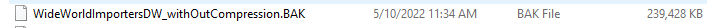{width="6.5in"
height="0.2548611111111111in"}

14. Ahora genere el backup con compresión y note la diferencia en el
    tamaño del backup.

BACKUP DATABASE WideWorldImportersDW TO
DISK=\'C:\\temp\\WideWorldImportersDW_withCompression.BAK\' with
compression

GO

{width="6.5in"
height="1.5055555555555555in"}

15. A continuación, vamos a crear una tabla adicional para recrear la
    transaccionalidad que ocurre diariamente en un motor de datos. El
    siguiente comando crea una nueva tabla basado en la respuesta de una
    consulta de la tabla Order.

> SELECT \[Order Key\]
>
> ,\[City Key\]
>
> ,\[Customer Key\]
>
> ,\[Stock Item Key\]
>
> ,\[Order Date Key\]
>
> ,\[Picked Date Key\]
>
> ,\[Salesperson Key\]
>
> ,\[Picker Key\]
>
> ,\[WWI Order ID\]
>
> ,\[WWI Backorder ID\]
>
> ,\[Description\]
>
> ,\[Package\]
>
> ,\[Quantity\]
>
> ,\[Unit Price\]
>
> ,\[Tax Rate\]
>
> ,\[Total Excluding Tax\]
>
> ,\[Tax Amount\]
>
> ,\[Total Including Tax\]
>
> ,\[Lineage Key\]
>
> into \[Fact\].\[OrderDelete\]
>
> FROM \[WideWorldImportersDW\].\[Fact\].\[Order\]

16. Ahora, vamos a crear una copia diferencial de la base de datos, para
    entender que es lo que realmente queda almacenado en este tipo de
    backups.

> BACKUP DATABASE \[WideWorldImportersDW\] TO DISK =
> N\'C:\\Temp\\WideWorldImportersDW_diff.bak\' WITH DIFFERENTIAL
>
> , NOFORMAT, INIT, NAME = N\'WideWorldImportersDW-Diferencial Database
> Backup\', SKIP, NOREWIND, NOUNLOAD, COMPRESSION, STATS = 10
>
> GO

17. Ahora ejecute el siguiente comando para borrar todos los registros
    en cuya descripción exista la palaba ***Developer***. Puede usar la
    opción de plan de ejecución para validar el plan de ejecución con
    que se ejecutó la consulta, esta es la mejor opción para entender
    realmente como el motor de optimización de consultas usa los
    índices.

> WAITFOR DELAY \'00:01\';
>
> DELETE FROM \[WideWorldImportersDW\].\[Fact\].\[OrderDelete\]
>
> WHERE \[Description\] like \'%Developer%\'

{width="4.635416666666667in"
height="0.34375in"}

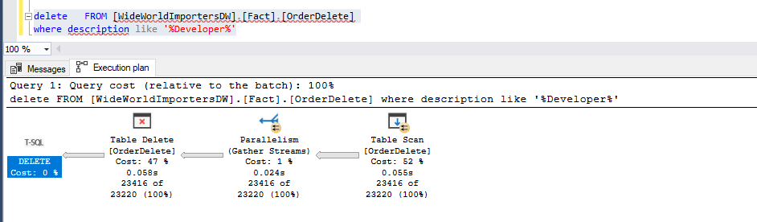{width="6.049922353455818in"
height="1.7723162729658792in"}

Valide la hora en que se ejecutó la eliminación de los registros. Y
anótela.

18. Suponga que el equipo de desarrollo, le notifica que, por un error
    en el despliegue de la aplicación, se borraron accidentalmente todas
    las ordenes de los developers, y que requieren que se restaure la
    información de la tabla, sin perder los cambios que han ocurrido en
    el resto de tablas del modelo. Y le informan que la hora en que se
    dio el incidente coincide con la que usted anotó en su punto
    anterior.

Para resolver este tipo de "desastres" normalmente utilizamos los
backups de log transaccional, los cuales nos permite restaurar la base
de datos a un instante del tiempo. A continuación, ejecutaremos un
backup de log transaccional para tomar todas las transacciones que se
han ejecutado en el motor desde el último backup diferencial.

> use master
>
> go
>
> BACKUP LOG \[WideWorldImportersDW\] TO DISK =
> N\'C:\\temp\\WideWorldImportersDW_Log.trn\'
>
> WITH NO_TRUNCATE , NOFORMAT, INIT, NAME = N\'WideWorldImportersDW-log
> transaccional\'
>
> , SKIP, NOREWIND, NOUNLOAD, NORECOVERY , COMPRESSION, STATS =
> 10,CONTINUE_AFTER_ERROR;
>
> GO

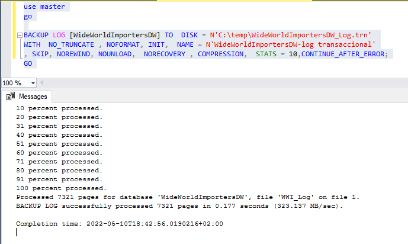{width="5.118947944006999in"
height="3.060978783902012in"}

19. Oprima clic derecho del mouse sobre la carpeta "Databases" en el
    explorador de objetos y de clic en la opción "Refresh". Valide que
    la base de datos se encuentra en este momento en un estado
    "Restoring", esto sería el equivalente al momento en quese debe

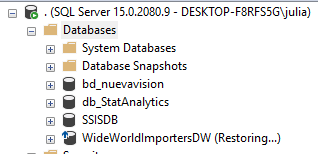{width="3.3125in"
height="1.6041666666666667in"}

20. Ahora realizaremos la restauración de la base de datos, para este
    escenario con un nombre nuevo, a fin que los desarrolladores validen
    que la información perdida se encuentra en la copia. Una vez nos
    confirmen que está correcta, restauraremos sobre la copia original
    de la base de datos.

> USE \[master\]
>
> RESTORE DATABASE \[WideWorldImportersDW_Mistery\] FROM DISK =
> N\'C:\\temp\\WideWorldImportersDW_withCompression.BAK\'
>
> WITH FILE = 1, MOVE N\'WWI_Primary\' TO
> N\'D:\\BasesDeDatos\\Data\\WideWorldImportersDW_Mistery.mdf\'
>
> , MOVE N\'WWI_UserData\' TO
> N\'D:\\BasesDeDatos\\Data\\WideWorldImportersDW_Mistery_UserData.ndf\'
>
> , MOVE N\'WWI_Log\' TO
> N\'D:\\BasesDeDatos\\Log\\WideWorldImportersDW_Mistery.ldf\'
>
> , MOVE N\'WWIDW_InMemory_Data_1\' TO
> N\'D:\\BasesDeDatos\\Data\\WideWorldImportersDW_Mistery_InMemory_Data_1\'
>
> , NORECOVERY, NOUNLOAD, STATS = 5
>
> GO

21. Valide que exista una nueva base de datos llamada
    WideWorldImportersDW_Mystery en su instancia y que esté en modo
    "Restoring".

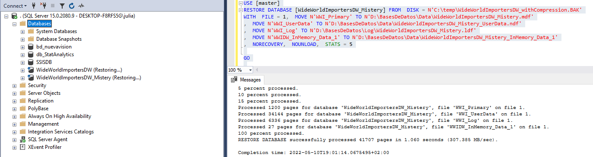{width="6.5in"
height="1.7326388888888888in"}

22. Ahora cargaremos el backup differencial en la nueva base de datos

> \-\-\-\-\-\-\-\-\-\-\-\-\-\-\-\-\-\-\-\-\-\-\-\-\-\-\-\-\-\-\-\-\-\-\-\-\-\--
>
> \--Restoration backup differential
>
> \-\-\-\-\-\-\-\-\-\-\-\-\-\-\-\-\-\-\-\-\-\-\-\-\-\-\-\-\-\-\-\-\-\-\-\-\-\-\-\-\-\-\-\-\--
>
> RESTORE DATABASE \[WideWorldImportersDW_Mistery\] FROM DISK =
> N\'C:\\temp\\WideWorldImportersDW_diff.bak\'
>
> WITH NORECOVERY, STATS = 5

GO

23. Ahora se hará la restauración del backup de log transaccional en la
    nueva base de datos y se dejará la base de datos disponible para
    consulta por parte de los desarrolladores. En este paso es
    importante reemplazar la fecha por la hora en la que se presentó el
    incidente, haga la restauración a 3 minutos antes de la fecha que
    anotó para estar seguro de tomar la hora antes del inicio de la
    transacción de borrado de información.

> \-\-\-\-\-\-\-\-\-\-\-\-\-\-\-\-\-\-\-\-\-\-\-\-\-\-\-\-\-\-\-\-\-\-\-\-\-\--
>
> \--Restoration backup tail-log
>
> \-\-\-\-\-\-\-\-\-\-\-\-\-\-\-\-\-\-\-\-\-\-\-\-\-\-\-\-\-\-\-\-\-\-\-\-\-\-\-\-\-\-\-\-\--
>
> RESTORE LOG \[WideWorldImportersDW_Mistery\] FROM DISK =
> N\'C:\\temp\\WideWorldImportersDW_Log.trn\' WITH NOUNLOAD, STATS = 10
> , STOPAT = N\'2022-05-10T18:00:34\'
>
> GO

24. Ejecute la siguiente consulta para confirmar que existen los
    registros en la base de datos.

> /\*\*\*\*\*\* Script for SelectTopNRows command from SSMS
> \*\*\*\*\*\*/
>
> SELECT TOP (1000) \[Order Key\]
>
> ,\[City Key\]
>
> ,\[Customer Key\]
>
> ,\[Stock Item Key\]
>
> ,\[Order Date Key\]
>
> ,\[Picked Date Key\]
>
> ,\[Salesperson Key\]
>
> ,\[Picker Key\]
>
> ,\[WWI Order ID\]
>
> ,\[WWI Backorder ID\]
>
> ,\[Description\]
>
> ,\[Package\]
>
> ,\[Quantity\]
>
> ,\[Unit Price\]
>
> ,\[Tax Rate\]
>
> ,\[Total Excluding Tax\]
>
> ,\[Tax Amount\]
>
> ,\[Total Including Tax\]
>
> ,\[Lineage Key\]
>
> FROM \[WideWorldImportersDW_Mistery\].\[Fact\].\[OrderDelete\]
>
> WHERE \[Description\] LIKE \'%DEVELOPER%\'

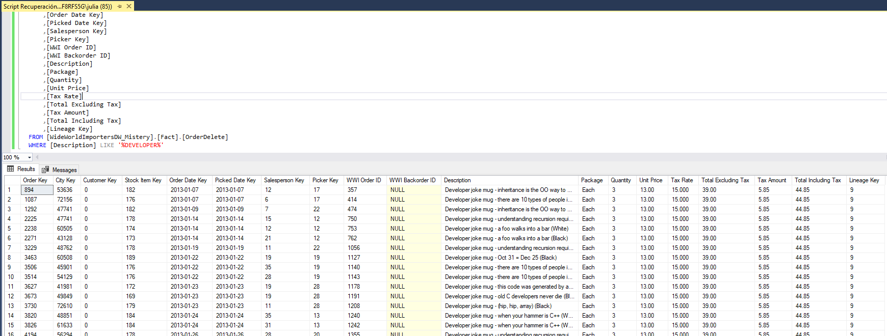{width="5.452094269466317in"
height="2.0678346456692913in"}

25. Ahora que ha conseguido ver los datos, elabore usted el script para
    restaurar los backups en la base de producción y dejarla operativa.
    Elimine la base de datos WideWorldImportersDW_Mistery.

26. Cierre la conexión a la máquina remota.

27. En el portal de Azure "**Detenga**" la máquina virtual para ahorrar
    los créditos disponibles en la capa gratuita.
